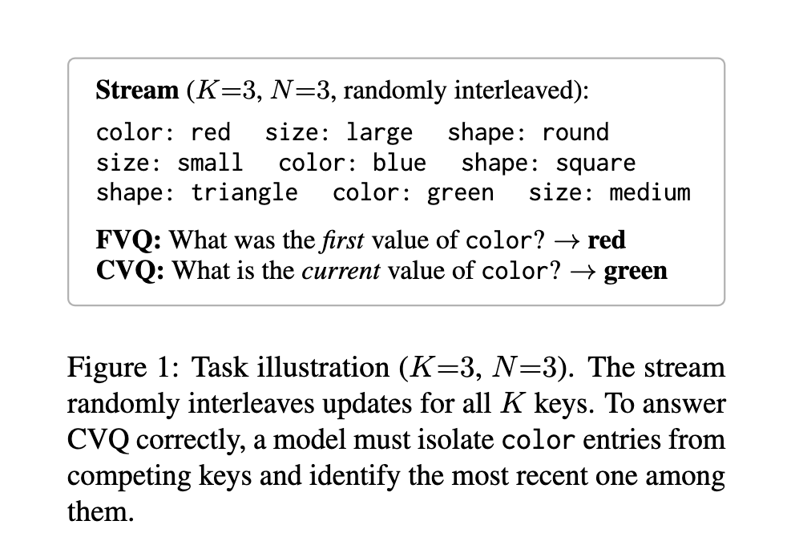

# Tracked but Suppressed: How LLMs Fail State Tracking

[](LICENSE)
[](paper.pdf)

**[📄 Read the paper (PDF)](paper.pdf)** — AAAI 2027 submission #38986, currently under anonymous review.

This repo studies a specific failure of pretrained language models — tracking
which value a variable currently holds after it has been overwritten several
times in-context — and traces it, mechanistically, to a specific circuit that
exists in the pretrained model but doesn't reach the output by default. It's
shared here to make the empirical and mechanistic-interpretability work behind
that paper checkable and reusable.

---

## TL;DR for a mech-interp / alignment reader

- A capability can be **behaviorally absent** (20/20 pretrained models fail
  it, at every training checkpoint we can check) while being **representationally
  present** (linearly decodable by a probe, briefly visible via logit lens) —
  a clean instance of a capability that exists in the weights but isn't
  routed to the output.
- We find the circuit responsible (15 attention heads, layers 30–33 of a
  36-layer model), show it's already a **partial** carrier of the right
  signal *before* any fine-tuning, and show a 7.4M-parameter LoRA (0.24% of
  weights) works by **amplifying that pre-existing circuit** (4–12× per head)
  plus **installing new downstream redundancy** — not by building a new
  pathway from scratch.
- The same behavioral recovery is also reachable with **zero weight changes**,
  just a prompt-format change — and the two fixes land on the same behavior
  through measurably different internal routes (§ Results below).
- We checked whether this is a training-data-scale problem by pushing on it
  from two directions: 79 public pretraining checkpoints (does it emerge
  later?) and training a transformer completely from scratch (does it emerge
  with no pretraining prior at all?). Neither closes the gap — see
  [Extended: from-scratch training](EXPERIMENTS.md#8-from-scratch-training-control-does-pretraining-matter).
- If you work on latent-capability elicitation, non-emergence, or circuit-level
  fine-tuning effects, the mechanism section (§5 of the paper,
  [EXPERIMENTS.md §6](EXPERIMENTS.md#6-mechanistic-analysis)) is the part most
  relevant to you.

## The task



A stream randomly interleaves updates to $K$ keys, $N$ updates each (no two
consecutive entries share a key). The model is asked one of three questions
about a target key:

- **FVQ** (first-value query) — what was the *first* value assigned?
- **CVQ** (current-value query) — what is the value *right now*?
- **IVQ** (intermediate-value query) — what was the value after the $k$-th
  update, for some $1<k<N$?

All three are trivially answerable by re-reading the prompt — there's no
length limit or missing information. A model that gets FVQ right and CVQ
wrong isn't failing at retrieval in general; it's failing at figuring out
*which* entry among several with the same key is the one that matters now.
That's the same operation multi-turn dialogue (respecting the latest
correction), RAG (using the latest document version), and tool-using agents
(reading a variable after a sequence of writes) all need.

## Why this matters (and what's already known)

Three bodies of prior work motivate this, and the paper's contribution
against each:

**The failure has been observed, not explained.** Multi-turn dialogue
degrades as state updates accumulate ([Laban et al. 2025, *LLMs Get Lost in
Multi-Turn Conversation*](https://arxiv.org/abs/2505.06120)); entity-state
tracking is inconsistent across models ([Kim & Schuster 2023](https://aclanthology.org/2023.acl-long.213/),
[Kim et al. 2024](https://arxiv.org/abs/2405.21068),
[Rezaee et al. 2025](https://arxiv.org/abs/2511.10457)); closest to our
setup, [Wang & Sun 2025, *Unable to Forget*](https://arxiv.org/abs/2506.08184)
report a log-linear accuracy decline on a similar key-value stream and
conclude it's fundamental. We show it's recoverable — from the pretrained
weights, with no new capability being taught — and trace the recovery to
specific heads. Related theoretical work on *why* attention should struggle
here: [Barbero et al. 2024, *Transformers Need Glasses*](https://proceedings.neurips.cc/paper_files/paper/2024/hash/b1d35561c4a4a0e0b6012b2af531e149-Abstract-Conference.html)
show decoder-only signal propagation can map distinct sequences to
near-identical final-token representations, which provably impairs counting
and copying; [Barbero et al. 2025, *Why Do LLMs Attend to the First Token?*](https://arxiv.org/abs/2504.02732)
analyze the attention-sink mechanism that limits cross-depth mixing. Also
adjacent: the static-context ["lost in the middle"](https://arxiv.org/abs/2307.03172)
pattern, and [prompt-format sensitivity up to 76pp](https://arxiv.org/abs/2310.11324)
(our format intervention, §Results, is a controlled instance of this).

**Fine-tuning can reveal capability that pretraining didn't surface.**
[Zhou et al. 2023, LIMA](https://arxiv.org/abs/2305.11206) show 1,000 curated
examples are enough to teach chat-following, arguing pretraining already did
the underlying work; [Sun & Dredze 2025, *Amuro & Char*](https://arxiv.org/abs/2408.06663)
make the general claim across 18 datasets. We use standard
[LoRA](https://arxiv.org/abs/2106.09685) and contribute a concrete instance
*with mechanism*: which heads, how much they change, and evidence they
already partially carried the signal before any gradient update — the kind
of causal story "latent capacity" claims usually lack.

**On the mechanistic-interpretability side**, this is a case study in
circuit discovery ([induction heads](https://arxiv.org/abs/2209.11895),
[IOI](https://arxiv.org/abs/2211.00593),
[ACDC](https://arxiv.org/abs/2304.14997), entity-binding:
[Feng & Steinhardt 2024](https://arxiv.org/abs/2310.17191),
[Gur-Arieh et al. 2025](https://arxiv.org/abs/2510.06182)) applied to a
*failure* rather than a success, and in the *non-emergence* question raised
by the [emergent abilities](https://arxiv.org/abs/2206.07682) /
[mirage](https://arxiv.org/abs/2304.15004) debate — we show a specific,
economically-relevant skill that doesn't emerge at any scale or training
stage we can check, paralleling [Allen-Zhu & Li 2024](https://arxiv.org/abs/2309.14316)'s
finding that pretrained models can store facts without a reliable retrieval
path to them.

Full related-work section, with all citations: [paper.pdf](paper.pdf) §2.

## Task formulation

- **Datasets.** `ARB` (Arbitrary-Single): 2,300 single-token English words
  across 46 categories — single-token values keep logit-lens/probing clean,
  so this is the dataset for all mechanistic work. `SEM` (Semantic-Multi):
  real category members as multi-token values (2,403 entries) — the primary
  *behavioral* dataset, since key–value semantic coherence blocks
  template-matching shortcuts.
- **Grid.** $K \in \{2,3,5,7,10,15,20,25,30\}$,
  $N \in \{5,7,10,15,20,30,50,75,100\}$, up to 200 trials per cell per query
  type, excluding cells that exceed a model's context or the dataset's value
  pool.
- **Metric.** Exact-match accuracy per query type, Wilson 95% CIs. Primary
  quantity is the **gap** $\Delta = \text{FVQ accuracy} - \text{CVQ accuracy}$;
  substantial when $|\Delta| > 0.05$. Greedy decoding throughout
  (temperature 0).
- **Models.** 20 total: 11 open-weight (Qwen2.5 0.5B–3B, Qwen3.5 0.8B–9B,
  Gemma-3 270M–4B) + 6 proprietary frontier (GPT-4.1, GPT-4.1-mini,
  Claude-4.5-Haiku, Claude-4.5-Sonnet, Gemini-2.5-Flash, Gemini-2.5-Pro), plus
  3 smaller open-weight models (TinyLlama-1.1B, StableLM-2-1.6B, Pythia-410M)
  in the appendix.

## What's implemented

Every item below has runnable code and committed results/figures in this
repo. Full detail, exact commands, models, and result-file pointers for each
are in **[EXPERIMENTS.md](EXPERIMENTS.md)**.

| # | Experiment | Answers |
|---|---|---|
| 1 | Behavioral sweep (20 models × full $K,N$ grid) | Does the gap exist, how big, does it depend on model size/family? |
| 2 | Format intervention (4 prompt formats × 10 models) | Can a training-free change fix it? |
| 3 | LoRA intervention (2 model families + negative control) | Can a tiny fine-tune fix it, and is the fix task-specific? |
| 4 | Training-dynamics sweep (79 checkpoints, 2 model families) | Does the gap close at any point in pretraining or post-training? |
| 5 | Mechanistic analysis (probing, logit lens, attention routing, causal ablation) | What does LoRA actually change inside the model? |
| 6 | From-scratch training control | Does the failure depend on *this* pretraining, or would any transformer trained on this task struggle the same way? |
| 7 | Extended/exploratory analyses (post-submission) | Where exactly does the LoRA fix stop generalizing, and does the format fix use the same circuit? |

## Headline results

**1. The gap is universal across scale and provider** (representative cells;
full grid in the paper appendix):

| Model | FVQ | CVQ | Gap |
|---|---|---|---|
| GPT-4.1 | 1.00 | 0.71 | +0.29 |
| Claude-4.5-Haiku | 1.00 | 0.53 | +0.47 |
| Gemini-2.5-Pro | 0.90 | 0.77 | +0.13 |
| Qwen2.5-3B-Instruct | 0.61 | 0.55 | +0.06 |
| Gemma-3-4b-it | 0.97 | 0.68 | +0.29 |
| Gemma-3-1b-it | 0.55 | 0.02 | +0.53 |

*(Proprietary models at K=20,N=50; open-weight at K=5,N=30, Semantic-Multi. No
model uses more than 3.3% of its context window at the cell it fails on — this
is not a length problem.)*

**2. Both a free lunch (format) and a cheap one (LoRA) fix it.** Format
intervention, hardest cell (K=10, N=50), FVQ / CVQ:

| Model | Plain | Block |
|---|---|---|
| Qwen2.5-3B-Instruct | 0.49 / 0.23 | 0.84 / 0.92 |
| Gemma-3-4b-it | 0.92 / 0.01 | 0.99 / 0.89 |
| Claude-4.5-Haiku | 1.00 / 0.43 | 1.00 / 0.99 |

LoRA (7.4M params, 0.24% of Qwen2.5-3B-Instruct), gap on held-out cells up to
10× the training grid — base vs. +LoRA:

| $(K,N)$ | Base gap | +LoRA gap |
|---|---|---|
| (15, 30) | −25% | +2% |
| (20, 50) | −54% | +4% |
| (30, 75) | −55% | +6% |

**3. The mechanism.** Bootstrap 95% CIs, baseline → +LoRA, Qwen2.5-3B-Instruct:

| Method | Quantity | Baseline | +LoRA | Δ |
|---|---|---|---|---|
| Linear probe | CVQ-correctness, L33 | 0.58 | 0.94 | +0.36 [+0.21, +0.50] |
| Logit lens | Pr(v_last), L32, K=2,N=5 | 0.34 | 0.99 | +0.65 [+0.55, +0.73] |
| Attention routing | Pr(attend v_last), L32H3 | 0.11 | 0.78 | +0.68 [+0.65, +0.71] |
| Causal ablation (8 promoter heads) | ΔPr(v_last), L32 | −0.28 | −0.40 | paired +0.12 [+0.02, +0.21] |

The last row is the causal punchline: ablating the same 8 heads hurts *both*
models, meaning the heads already carry signal in the base model — LoRA
amplifies an existing circuit rather than building a new one. Full numbers,
all four methods, and the Gemma-3-4b-it cross-family replication:
[EXPERIMENTS.md §6](EXPERIMENTS.md#6-mechanistic-analysis).

## Reproducing

```bash
# uv is the supported installer
uv venv && source .venv/bin/activate
uv pip install -r requirements.txt

# API keys for proprietary models (skip if only running open-weight/local)
export ANTHROPIC_API_KEY=...
export OPENAI_API_KEY=...
export GOOGLE_API_KEY=...
```

Every experiment category has a runnable entry point — see
**[EXPERIMENTS.md](EXPERIMENTS.md)** for the exact command, model list, and
where its output lands. A few representative ones:

```bash
# Behavioral sweep on a local open-weight model
python v3/scripts/experiments/stage1_sweep.py --model Qwen2.5-3B-Instruct

# Train the main LoRA adapter (or reuse the committed checkpoint at
# lora_intervention/checkpoints/adapter/)
python lora_intervention/train.py

# Evaluate it on the held-out grid
python lora_intervention/evaluate.py --adapter checkpoints/adapter

# Mechanistic probing / logit lens / attention routing / causal ablation
python v3/scripts/experiments/stage2_logit_lens.py
python v3/scripts/experiments/probing_classifier.py
python v3/scripts/experiments/stage3_causal.py
```

## Repository layout

```
paper.pdf                    ← the paper (copy of aaai_submission/main.pdf)
aaai_submission/              ← submission package: main.tex/pdf, supplement, reproducibility checklist
EXPERIMENTS.md                ← full experiment inventory: methods, models, results, code pointers
README.md                     ← this file

mechanistic_probing_v2/core/  ← shared dataset construction, model loading, evaluation (imported everywhere below)
models/                       ← provider interfaces (Claude, GPT, Gemini, Bedrock) for the proprietary-model sweeps
narrative_generator/          ← naturalistic (museum-domain) task variant

v3/                           ← current behavioral + mechanistic pipeline (open-weight models)
  results_vllm/                 canonical results: behavioral sweeps, logit lens, attention routing, probing
  scripts/experiments/           the 5 canonical runners (stage1_sweep, stage2_logit_lens, stage3_causal, probing_classifier, training_dynamics)

lora_intervention/            ← LoRA training + evaluation pipeline, checkpoints, mechanism-on-LoRA experiments
experiments_cloud/            ← proprietary-model sweeps + the format/ucurve intervention experiments
synthetic_scratch_training/   ← from-scratch GPT-2 training control (self-contained, own uv env)

paper/                        ← earlier ACL-formatted draft ("What Pretraining Doesn't Learn") — figure/table generator scripts here are still live and feed aaai_submission/figures/
present/                       ← slides and presentation figures
dev-notes/                     ← working notes, session logs, verified-claims audit — see dev-notes/README.md
legacy/                        ← superseded code from an earlier project phase (PI/RI framing); kept for history
reference/                      ← background reading (PDFs)
```

## Limitations (from the paper)

- Synthetic task; linking the gap to application-level failures (multi-turn
  dialogue, entity-state tracking) is open.
- English only; training-dynamics checkpoints are bounded by public releases
  (≤3B parameters).
- LoRA is attention-only (Q/K/V/O, rank 16); whether MLP-targeted or
  full-parameter fine-tuning surfaces the capability through a different
  pre-existing circuit is open.
- What predicts the primacy-vs-reversal split across model families (Qwen
  crosses into reversal, Gemma never does) is open.

## Ethical considerations

Synthetic key–value streams from public English vocabulary; no human
subjects, no PII. Open-weight models used under their licenses; proprietary
models via APIs under standard terms of service. The finding informs
deployment guidance directly: LLMs should not be relied on to track
repeatedly-updated in-context variables without explicit positional cues
(format intervention) or targeted fine-tuning (LoRA).

## Citation

The paper is under anonymous review; please don't cite author identity from
this repo. BibTeX (update once public):

```bibtex
@misc{anon2027trackedbutsuppressed,
  title  = {Tracked but Suppressed: How LLMs Fail State Tracking},
  author = {Anonymous},
  note   = {AAAI 2027 submission \#38986, under review},
  year   = {2027}
}
```

## License

[MIT](LICENSE).
